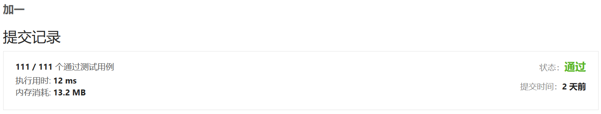

# Homework2
###### Name: 李杭禹
###### StudentID: 2201212834

## Leetcode 7

#### 算法思路
* 将给定的数字用栈的方式，实现反转，并将反转的结果存到一个字符串num_str中。
* 去掉字符串中开头多余的‘0’。(如：数字12300翻转以后，字符串会存储为00321)
* 判断反转后的字符串所代表的数字是否是32位的，有三种情况：
    * 如果字符串中数字的长度大于10位，则该数字肯定超过了32位的限制，直接返回0即可。
    * 如果字符串中数字的长度小于10位，则改数字肯定没有超过32位的限制，直接用 int(num_str)返回该字符串代表的数字即可。(注意正负值)
    * 如果字符串中数字的长度刚好等于10位，这时候就判断该字符串代表的数字，是否位于-2^31和2^31之间(逐位比较)，如果在它们两个中间，则代表该值在32位以内，直接返回该值，否则返回。
#### 代码实现

```python
class Stack(object):
    def __init__(self):
        self.items = []
    def isEmpty(self):
        return self.items==[]
    def push(self,item):
        self.items.append(item)
    def pop(self):
        return self.items.pop()
    def peek(self):
        return self.items[len(self.items)-1]
    def size(self):
        return len(self.items)

#去掉字符串开头的所有0
def remv_0(num_str):
    t = 0 ## t表示在字符串的开头0出现的次数，
    for i in range(len(num_str)):
        if num_str[i] == '0':
            t += 1
        else : break
    return num_str[t:]

#判断一个用字符串表示的数，是否是32位的,是的话返回true
def is_int(flag,num_str):
    num_max_list = [2,1,4,7,4,8,3,6,4,7]
    num_min_list = [2,1,4,7,4,8,3,6,4,8]
    num_list = []
    for i in range(len(num_str)):
        num_list.append(int(num_str[i]))
    if flag==1:
        j = 0
        while j < 10:
            if num_list[j] < num_max_list[j]:
                return True
            elif num_list[j] == num_max_list[j]:
                if j == 9 :
                    return True
                j += 1
            else :
                return False          
    if flag==-1:
        j = 0
        while j < 10:
            if num_list[j] < num_min_list[j]:
                return True
            elif num_list[j] == num_min_list[j]:
                if j == 9 :
                    return True
                j += 1
            else :
                return False       
            
class Solution(object):
    def reverse(self, x):
        """
        :type x: int
        :rtype: int
        """
        stack = Stack()
        flag = 1 ##用于标记x是正数还是负数 
        if x == 0 :
            return 0
        
        if x<0 :
            flag = -1
            #stack.push('-')
            x = -x

        while x>0 :
            mod = x % 10
            stack.push(mod)
            x = x//10
        
        num_str = ""
        while not stack.isEmpty() :
            tmp = stack.pop()
            tmp = str(tmp)
            num_str = tmp + num_str

        result = 0
        num_str = remv_0(num_str)
        
        length = len(num_str)
        if length > 10 :
            return 0
        elif length == 10:
            if is_int(flag,num_str) :
                return flag*int(num_str)
            else: return 0             
        else :
            return flag*int(num_str)
```
#### 运行结果


## Leetcode 13
#### 算法思路
新建一个哈希表存储每个罗马字母对应的数值，key为罗马字母，value为单个字母代表的数字。初始一个num变量，初始值为0.然后遍历给出的包含罗马字符的字符串，共有以下三种情况:
1. 当前字母代表的数值大于右侧，则将其代表的值加到num变量上；
2. 当前字母代表的数值大于右侧，则用num变量减去其代表的数值；
3. 当前字母为最后一位数字，则不用比较直接将其代表的值加到num变量上。
#### 代码实现
```python
class Solution(object):
    def romanToInt(self, s):
        """
        :type s: str
        :rtype: int
        """
        Roma_dict = {'I':1,
                     'V':5,
                     'X':10,
                     'L':50,
                     'C':100,
                     'D':500,
                     'M':1000}
        num = 0
        for i in range(len(s)):
            if  i == len(s)-1:
                num += Roma_dict[s[i]]
            elif Roma_dict[s[i]] >= Roma_dict[s[i+1]]:
                num += Roma_dict[s[i]]
            else :
                num -= Roma_dict[s[i]]
        return num
```
#### 运行结果


## Leetcode 66

#### 算法思路
* 先将末尾数字+1，之后从后往前遍历数组。
   * 如果当前所在位置的数组的值为10，则将其变为0，并且数组的前一位+1.
   * 如果数组的第一位也为10，则将该位变为0，并且在数组前方插入一个数字‘1’。
#### 代码实现

```python
class Solution(object):
    def plusOne(self, digits):
        """
        :type digits: List[int]
        :rtype: List[int]
        """
        i = len(digits)-1
        digits[i] = digits[i] + 1
        while digits[i]==10 and i >=1 :
            digits[i] = 0
            digits[i-1] = digits[i-1]+1
            i -= 1
        if digits[0]==10:
            digits[0] = 0
            digits.insert(0,1)
        return digits
```

#### 运行结果

