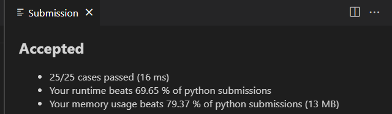

# Homework3
###### Name: 李杭禹
###### StudentID: 2201212834

## Leetcode 16

#### 算法思路
* 将给定的数字用栈的方式，实现反转，并将反转的结果存到一个字符串num_str中。
* 去掉字符串中开头多余的‘0’。(如：数字12300翻转以后，字符串会存储为00321)
* 判断反转后的字符串所代表的数字是否是32位的，有三种情况：
    * 如果字符串中数字的长度大于10位，则该数字肯定超过了32位的限制，直接返回0即可。
    * 如果字符串中数字的长度小于10位，则改数字肯定没有超过32位的限制，直接用 int(num_str)返回该字符串代表的数字即可。(注意正负值)
    * 如果字符串中数字的长度刚好等于10位，这时候就判断该字符串代表的数字，是否位于-2^31和2^31之间(逐位比较)，如果在它们两个中间，则代表该值在32位以内，直接返回该值，否则返回。
#### 代码实现

```python

```
#### 运行结果


## Leetcode 17
#### 算法思路
新建一个哈希表存储每个罗马字母对应的数值，key为罗马字母，value为单个字母代表的数字。初始一个num变量，初始值为0.然后遍历给出的包含罗马字符的字符串，共有以下三种情况:
1. 当前字母代表的数值大于右侧，则将其代表的值加到num变量上；
2. 当前字母代表的数值大于右侧，则用num变量减去其代表的数值；
3. 当前字母为最后一位数字，则不用比较直接将其代表的值加到num变量上。
#### 代码实现
```python
class Solution(object):
    def romanToInt(self, s):
        """
        :type s: str
        :rtype: int
        """
        Roma_dict = {'I':1,
                     'V':5,
                     'X':10,
                     'L':50,
                     'C':100,
                     'D':500,
                     'M':1000}
        num = 0
        for i in range(len(s)):
            if  i == len(s)-1:
                num += Roma_dict[s[i]]
            elif Roma_dict[s[i]] >= Roma_dict[s[i+1]]:
                num += Roma_dict[s[i]]
            else :
                num -= Roma_dict[s[i]]
        return num
```
#### 运行结果


## Leetcode 21

#### 算法思路

#### 代码实现

```python
class Solution(object):

```

#### 运行结果

