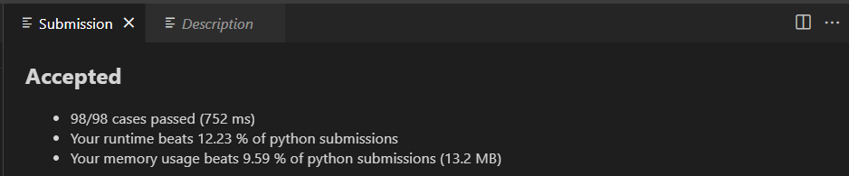
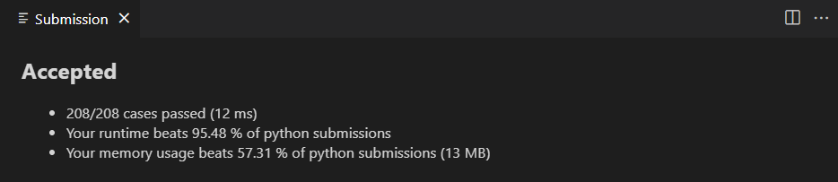

# Homework3
###### Name: 李杭禹
###### StudentID: 2201212834

## Leetcode 16

#### 题目描述
给你一个长度为 n 的整数数组 nums 和 一个目标值 target。请你从 nums 中选出三个整数，使它们的和与 target 最接近。
返回这三个数的和。假定每组输入只存在恰好一个解。

链接：https://leetcode.cn/problems/3sum-closest
#### 算法思路
###### 双指针法

首先对数组进行排序
对于待选的三个整数，先枚举第一个元素a,对于第二和第三个元素b,c采用双指针的方法遍历。
用 P<sub>b</sub> 和 P<sub>c</sub> 代表指向b和c的指针。
* 假设数组的长度为n，枚举的元素a在数组中的位置为i
* 为了防止重复枚举，在位置【i+1,n）的范围内枚举b和c。
   * 如果a+b+c < target 则 P<sub>c</sub> 向左移动一个单位。
   * 如果a+b+c > target 则 P<sub>b</sub> 向左移动一个单位。
#### 代码实现

```python
class Solution(object):

    def threeSumClosest(self, nums, target):
        """
        :type nums: List[int]
        :type target: int
        :rtype: int
        """
        nums.sort()
        l = len(nums)
        res = 100000

        def updt_res(num):
            return num if abs(num-target) < abs(res-target) else res
    
        for i in range(l):
            
            left,right= i+1,l-1
            #Sum = nums[i]+nums[left]+nums[right]
            #updt_res(Sum)
            while left >= 0 and right <= l-1 and left < right:
                Sum = nums[i]+nums[left]+nums[right]
                res = updt_res(Sum)
                if Sum < target:
                    left += 1
                elif Sum > target:
                    right -= 1
                else :
                    return target
        return res                
```
#### 运行结果


## Leetcode 17
#### 题目描述
给定一个仅包含数字 2-9 的字符串，返回所有它能表示的字母组合。答案可以按任意顺序返回。给出数字到字母的映射如下（与电话按键相同）。注意 1 不对应任何字母。

链接：https://leetcode.cn/problems/letter-combinations-of-a-phone-number

#### 算法思路
首先使用哈希表存储每个数字对应的所有可能的字母，然后进行回溯操作。

回溯过程中维护一个字符串，表示已有的字母排列（如果未遍历完电话号码的所有数字，则已有的字母排列是不完整的）。该字符串初始为空。每次取电话号码的一位数字，从哈希表中获得该数字对应的所有可能的字母，并将其中的一个字母插入到已有的字母排列后面，然后继续处理电话号码的后一位数字，直到处理完电话号码中的所有数字，即得到一个完整的字母排列。然后进行回退操作，遍历其余的字母排列。

回溯算法用于寻找所有的可行解，如果发现一个解不可行，则会舍弃不可行的解。在这道题中，由于每个数字对应的每个字母都可能进入字母组合，因此不存在不可行的解，直接穷举所有的解即可。

#### 代码实现
```python
class Solution(object):
    res = [] ##类内变量，用于存储最终返回的结果

    #回溯函数，用于回溯更新 变量res的值
    def BackTrack(self,digits,single_choice,choice_map):
        if len(single_choice) == len(digits) :
            Solution.res.append(single_choice)
            return

        choice_str = choice_map[digits[len(single_choice)]]
        for i in range(len(choice_str)):
            single_choice = single_choice + choice_str[i]

            self.BackTrack(digits,single_choice,choice_map)
                
            single_choice = single_choice[:-1]
    def letterCombinations(self, digits):
        """
        :type digits: str
        :rtype: List[str]
        """
        if digits == "":
            return []
        
        letter_map = {'':'',
                      '2':'abc',
                      '3':'def',
                      '4':'ghi',
                      '5':'jkl',
                      '6':'mno',
                      '7':'pqrs',
                      '8':'tuv',
                      '9':'wxyz'}
        single_choice = ''
        Solution.res = list()
        Solution.BackTrack(self,digits,single_choice,letter_map)
        return Solution.res
```
#### 运行结果


## Leetcode 21

#### 题目描述
给你一个链表，删除链表的倒数第 n 个结点，并且返回链表的头结点。

#### 算法思路
1. 计算链表长度
   计算链表成都
2. 栈
3. 双指针
4. 递归
#### 代码实现(2.双指针)

```python
class ListNode(object):
     def __init__(self, val=0, next=None):
         self.val = val
         self.next = next
class Solution(object):
    def removeNthFromEnd(self, head, n):
        """
        :type head: ListNode
        :type n: int
        :rtype: ListNode
        """
        dummy = ListNode(0,head)
        fast_node = ListNode(0,dummy)
        slow_node = ListNode(0,dummy)
        for i in range(n):
            fast_node = fast_node.next
        while fast_node.next != None :
            slow_node, fast_node = slow_node.next,fast_node.next
        slow_node.next =  slow_node.next.next
        
        return dummy.next
```

#### 运行结果

