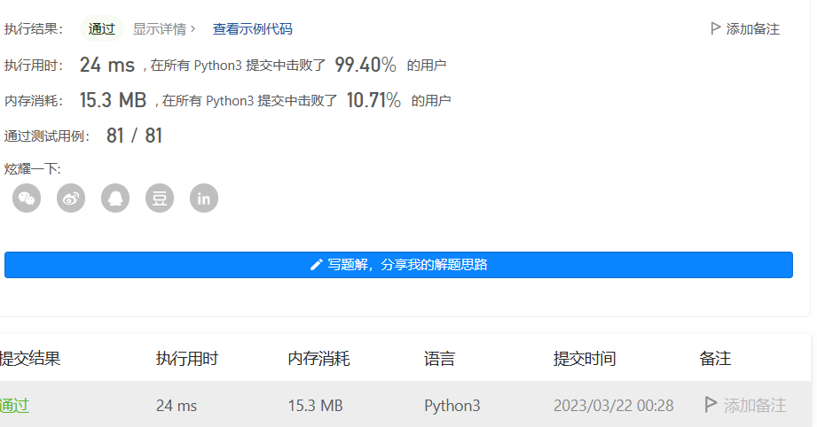
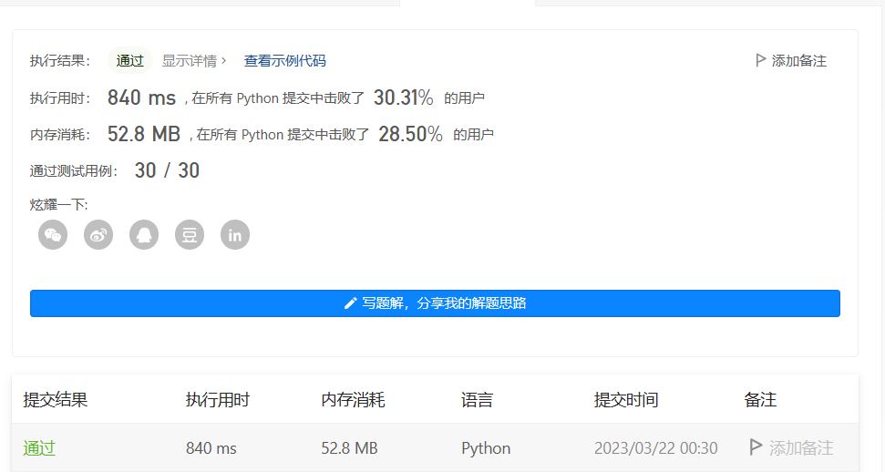
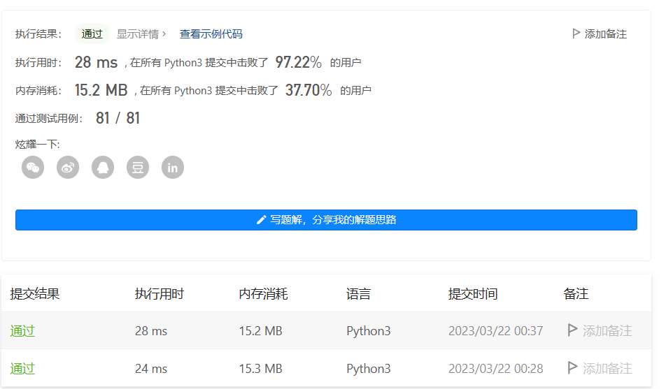

# Homework4
###### Name: 李杭禹
###### StudentID: 2201212834

## Leetcode 56

#### 题目描述
以数组 intervals 表示若干个区间的集合，其中单个区间为 intervals[i] = [starti, endi] 。请你合并所有重叠的区间，并返回 一个不重叠的区间数组，该数组需恰好覆盖输入中的所有区间 。

链接：https://leetcode.cn/problems/merge-intervals

#### 算法思路
###### 排序
如果我们按照区间的左端点排序，那么在排完序的列表中，可以合并的区间一定是连续的。如下图所示，标记为蓝色、黄色和绿色的区间分别可以合并成一个大区间，它们在排完序的列表中是连续的：


我们用数组 merged 存储最终的答案。

首先，我们将列表中的区间按照左端点升序排序。然后我们将第一个区间加入 merged 数组中，并按顺序依次考虑之后的每个区间：
* 如果当前区间的左端点在数组 merged 中最后一个区间的右端点之后，那么它们不会重合，我们可以直接将这个区间加入数组 merged 的末尾；
* 否则，它们重合，我们需要用当前区间的右端点更新数组 merged 中最后一个区间的右端点，将其置为二者的较大值。


#### 代码实现

```python
class Solution:
    def merge(self, intervals: List[List[int]]) -> List[List[int]]:
        intervals.sort(key=lambda x: x[0])

        merged = []
        for interval in intervals:
            # 如果列表为空，或者当前区间与上一区间不重合，直接添加
            if not merged or merged[-1][1] < interval[0]:
                merged.append(interval)
            else:
                # 否则的话，我们就可以与上一区间进行合并
                merged[-1][1] = max(merged[-1][1], interval[1])

        return merged   
```
#### 运行结果


## Leetcode 148
#### 题目描述
给你链表的头结点 head ，请将其按 升序 排列并返回 排序后的链表 。

链接：https://leetcode.cn/problems/sort-list

#### 算法思路
「147. 对链表进行插入排序」要求使用插入排序的方法对链表进行排序，插入排序的时间复杂度是 O(n2)，其中 n 是链表的长度。这道题考虑时间复杂度更低的排序算法。题目的进阶问题要求达到 O(nlogn) 的时间复杂度和 O(1) 的空间复杂度，时间复杂度是 O(nlogn) 的排序算法包括归并排序、堆排序和快速排序（快速排序的最差时间复杂度是 O(n2)），其中最适合链表的排序算法是归并排序。
归并排序基于分治算法。最容易想到的实现方式是自顶向下的递归实现，考虑到递归调用的栈空间，自顶向下归并排序的空间复杂度是 O(logn)。如果要达到 O(1) 的空间复杂度，则需要使用自底向上的实现方式。
###### 方法一：自顶向下归并排序

对链表自顶向下归并排序的过程如下。
1. 找到链表的中点，以中点为分界，将链表拆分成两个子链表。寻找链表的中点可以使用快慢指针的做法，快指针每次移动 2 步，慢指针每次移动 1 步，当快指针到达链表末尾时，慢指针指向的链表节点即为链表的中点。
2. 对两个子链表分别排序。
3. 将两个排序后的子链表合并，得到完整的排序后的链表。可以使用「21. 合并两个有序链表」的做法，将两个有序的子链表进行合并。

上述过程可以通过递归实现。递归的终止条件是链表的节点个数小于或等于 1，即当链表为空或者链表只包含 1 个节点时，不需要对链表进行拆分和排序。

###### 方法二：自底向上归并排序

首先求得链表的长度length，然后将链表拆分成子链表进行合并。具体做法如下：
1. 用intv表示每次需要排序的子链表的长度，初始时intv=1。

2. 每次将链表拆分成若干个长度为intv的子链表（最后一个子链表的长度可以小于intv），按照每两个子链表一组进行合并，合并后即可得到若干个长度为intv×2 的有序子链表（最后一个子链表的长度可以小于intv×2）。然后合并两个子链表。

3. 将intv的值加倍，重复第 2 步，对更长的有序子链表进行合并操作，直到有序子链表的长度大于或等于length，整个链表排序完毕。

#### 代码实现
```python
# Definition for singly-linked list.
class ListNode(object):
    def __init__(self, val=0, next=None):
        self.val = val
        self.next = next
class Solution(object):
    def sortList(self, head):
        """
        :type head: ListNode
        :rtype: ListNode
        """
        if not head or not head.next: return head # termination.
        # cut the LinkedList at the mid index.
        slow, fast = head, head.next
        while fast and fast.next:
            fast, slow = fast.next.next, slow.next
        mid, slow.next = slow.next, None # save and cut.
        # recursive for cutting.
        left, right = self.sortList(head), self.sortList(mid)
        # merge `left` and `right` linked list and return it.
        h = res = ListNode(0)
        while left and right:
            if left.val < right.val: h.next, left = left, left.next
            else: h.next, right = right, right.next
            h = h.next
        h.next = left if left else right
        return res.next

        
```
#### 运行结果


## Leetcode 274

#### 题目描述
给你一个整数数组 citations ，其中 citations[i] 表示研究者的第 i 篇论文被引用的次数。计算并返回该研究者的 h 指数。

根据维基百科上 h 指数的定义：h 代表“高引用次数”，一名科研人员的 h指数是指他（她）的 （n 篇论文中）总共有 h 篇论文分别被引用了至少 h 次。且其余的 n - h 篇论文每篇被引用次数 不超过 h 次。
如果 h 有多种可能的值，h 指数 是其中最大的那个

链接：https://leetcode.cn/problems/h-index

#### 算法思路
###### 排序
首先我们可以将初始的 H指数 h设为 0，然后将引用次数排序，并且对排序后的数组从大到小遍历。根据 H 指数的定义，如果当前 H 指数为 h 并且在遍历过程中找到当前值 
citations[i]>h，则说明我们找到了一篇被引用了至少 h+1 次的论文，所以将现有的 h 值加1。继续遍历直到 h 无法继续增大。最后返回 h 作为最终答案。

#### 代码实现

```python
class Solution:
    def hIndex(self, citations: List[int]) -> int:
        sorted_citation = sorted(citations, reverse = True)
        h = 0; i = 0; n = len(citations)
        while i < n and sorted_citation[i] > h:
            h += 1
            i += 1
        return h
```

#### 运行结果


